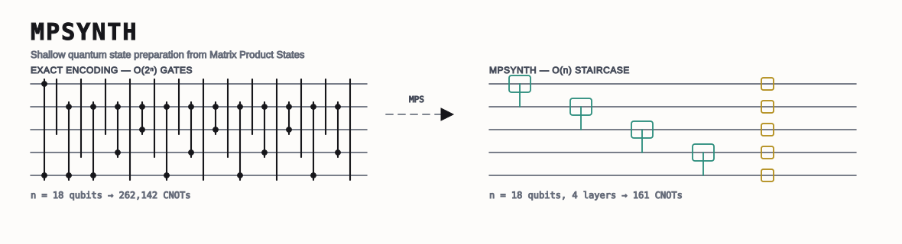
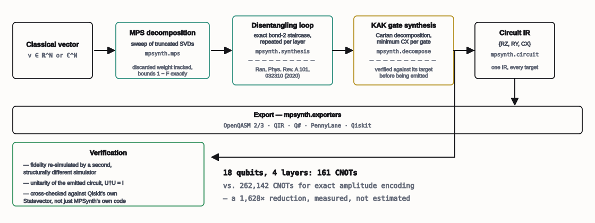

<p>
  
  
  
  
  <a href="LICENSE"></a>
  <a href="https://github.com/egemensariaslan/mpsynth/actions/workflows/ci.yml"></a>
</p>

> **Built for the Microsoft AI/ML Summer Internship Programme, 2026.**
> Capstone project by **Egemen Sarıaslan**, covering problem framing, research, implementation, evaluation and write-up. Carried out under the supervision of Microsoft Cloud Solution Architects Management.
>
> <sub>A capstone project produced during the programme. Not a Microsoft product, not affiliated with or endorsed by Microsoft Corporation; Microsoft and Azure are their trademarks.</sub>

A synthesis engine that turns a classical data vector into a shallow quantum
state-preparation circuit — one you actually choose the accuracy of, rather than one that
demands exact fidelity and pays for it in gates you cannot afford.

Loading an `N`-dimensional vector into an `n = log₂N`-qubit register exactly (amplitude
encoding) costs **O(2ⁿ)** gates. On real hardware and on classical simulators alike, that
consumes the entire coherence and compute budget before any actual computation begins —
the input state decoheres on the way in. MPSynth compresses the vector into a Matrix
Product State first, truncates its bond dimension to a fidelity tolerance *you* pick, and
synthesises the result as a stack of nearest-neighbour two-qubit staircases. Depth grows
**linearly** in `n`, not exponentially — measured, not asserted, in [§2](#2-results).

| | what could go wrong | is it checked? |
|---|---|---|
| **Decomposition** | truncation silently loses fidelity | **Yes.** Discarded weight is tracked and bounds `1 − F` exactly |
| **Gate synthesis** | a wrong construction ships silently | **Yes.** Every KAK construction is verified against its target before being emitted |
| **Export** | the emitted circuit doesn't match what was reported | **Yes.** Cross-checked against Qiskit's own `Statevector`, not just MPSynth's own simulator |
| **The input itself** | the vector just doesn't compress | Reported, not hidden — [§5](#5-when-this-does-not-help) |



---

## Table of contents

- [1. The problem](#1-the-problem)
- [2. Results](#2-results)
- [3. How it works](#3-how-it-works)
- [4. Is the fidelity bound real?](#4-is-the-fidelity-bound-real)
- [5. When this does not help](#5-when-this-does-not-help)
- [6. Engineering](#6-engineering)
- [7. Running it](#7-running-it)
- [8. Repository layout](#8-repository-layout)
- [9. Known limitations](#9-known-limitations)
- [10. References](#10-references) · [Licence and citation](#licence-and-citation) · [Author](#author)

---

## 1. The problem

Every quantum algorithm that starts from classical data — option pricing, quantum
chemistry initial states, QML feature maps — needs that data loaded as amplitudes first.
The textbook construction (Möttönen et al. 2005; Shende, Bullock & Markov 2006) is exact
and needs `2ⁿ − 2` CNOTs. On an 18-qubit register that is 262,142 two-qubit gates before
the algorithm the state was loaded *for* has run a single step. Near-term hardware and
even noiseless classical simulators cannot absorb that.

The fix used here is not new physics — sequential MPS disentangling was published by Ran
in 2020 ([§10](#10-references)) — but a synthesis *engine* around it: exact bond-2
staircases, an iterative disentangling loop for higher bond dimension, an exact
Cartan (KAK) decomposition lowering every two-qubit gate to the minimum CX count its
coordinates allow, and export to five frameworks from one shared gate set so a reported
depth means the same thing everywhere it is emitted.

---

## 2. Results

Every number below is regenerated by a committed script — `python examples/benchmark.py`
for the cost table, `python validation/run_validation.py --trials 300` for the
statistical suite. A fresh clone reproduces both with no external download, so nothing
here can drift from what the code actually produced.

### Cost at a fixed fidelity target

10 qubits, fidelity target 0.99, exact-encoding baseline ~1,022 CNOTs:

| input | kind | bond dim | layers | CNOT | 2q-depth | fidelity | vs. exact |
| --- | --- | ---: | ---: | ---: | ---: | ---: | ---: |
| `product` | product state | 1 | 1 | **0** | 0 | 1.000000 | — |
| `ghz` | GHZ state | 2 | 1 | 17 | 17 | 1.000000 | 60× |
| `w` | W state | 2 | 1 | 21 | 21 | 1.000000 | 49× |
| `damped` | damped oscillation | 2 | 1 | 23 | 23 | 1.000000 | 44× |
| `gaussian` | smooth analytic | 11 | 1 | 24 | 24 | 0.998696 | 43× |
| `lognormal` | skewed density | 9 | 1 | 24 | 24 | 0.997502 | 43× |
| `lorentzian` | heavy shoulders | 12 | 1 | 24 | 24 | 0.999357 | 43× |
| `heavytail` | power law | 9 | 1 | 24 | 24 | 0.999937 | 43× |
| `bimodal` | two-peak density | 13 | 3 | 70 | 35 | 0.994648 | 15× |
| `random` | i.i.d. noise | 32 | 12 | 242 | 79 | **0.330** | *target not reached* |

The last row is not an oversight — see [§5](#5-when-this-does-not-help).

### Scaling

Smooth input, 4 layers — cost is essentially flat while the exact baseline doubles every
qubit:

| qubits | amplitudes | CNOT | 2q-depth | fidelity | exact CNOTs |
| ---: | ---: | ---: | ---: | ---: | ---: |
| 10 | 1,024 | 89 | 39 | 0.999916 | 1,022 |
| 12 | 4,096 | 113 | 45 | 0.999917 | 4,094 |
| 14 | 16,384 | 134 | 51 | 0.999917 | 16,382 |
| 16 | 65,536 | 149 | 57 | 0.999917 | 65,534 |
| 18 | 262,144 | 161 | 63 | 0.999917 | 262,142 |

Linear regression on this table: **R² = 0.982**, slope 9.8 CNOT/qubit.

### Cross-validated against an independent implementation

Six statistical checks, each run across hundreds of random trials rather than a single
example. Two cross-check against **Qiskit's own code** — its `Statevector` simulator and
its `StatePreparation` construction — rather than MPSynth checking its own arithmetic.

| check | result |
| --- | --- |
| Fidelity reproducibility (300 trials, 11 dataset families) | max discrepancy **1.7×10⁻¹⁵** |
| Cross-validated against Qiskit's `Statevector` (300 trials) | max discrepancy **2.4×10⁻¹⁵** |
| Trade-off monotonicity (300 trials, 1,068 curve points) | **0 violations** |
| CNOT reduction vs. Qiskit's own exact `StatePreparation` | **14.6× fewer** on average (95% CI ±6.7), min 2.9× |
| Linear CNOT scaling (n = 8 to 18) | **R² = 0.982** |
| Normalisation & unitarity under aggressive truncation | max error **3.3×10⁻¹⁵** |

Full methodology and what each check does and does not establish:
[`validation/VALIDATION.md`](validation/VALIDATION.md). Runs in CI on every push.

---

## 3. How it works

One staircase of nearest-neighbour two-qubit gates prepares a bond-dimension-2 Matrix
Product State *exactly*; stacking `L` such staircases, each disentangling what the last
one left behind, recovers higher bond dimension at `O(L·n)` two-qubit gates instead of
`O(2ⁿ)`. Every two-qubit gate is then lowered to `{RZ, RY, CX}` by an exact Cartan (KAK)
decomposition using the minimum CX count its Weyl-chamber coordinates allow.

Full derivation, the module map, the qubit-ordering convention (getting this wrong gives
a bit-reversed state at a plausible-looking fidelity), and the trade-off profiler:
**[`docs/01-technical-approach.md`](docs/01-technical-approach.md)**.

---

## 4. Is the fidelity bound real?

`1 − F` is not measured after the fact and hoped for — it is bounded *before* synthesis
runs. SVD truncation at each bond discards a known relative weight; the sum of discarded
weights across every truncation is a provable upper bound on `1 − F`, checked directly in
`tests/test_mps.py` (`1 − fidelity <= discarded_weight`, not merely "usually holds"). The
reported fidelity itself is then re-measured from the *emitted circuit*, independently of
the internal tensor-network state — [§2](#2-results)'s cross-validation is exactly this
number, checked twice, by two different simulators.

What is *not* claimed: the bound is on truncation error, not on how compressible an
arbitrary input is. An incompressible input still returns an honest low fidelity — see
next.

---

## 5. When this does not help

**MPSynth compresses structure, and i.i.d. random noise has none.** A Haar-random vector
has near-maximal entanglement across every cut, its MPS bond dimension is the full
`2^{n/2}`, and no shallow circuit can reproduce it — that is information-theoretic, not an
implementation gap. The `random` row in [§2](#2-results)'s table stalls around F ≈ 0.33,
and the tool reports that rather than a flattering number. Real data — densities,
signals, images, smooth functions, financial distributions — is the regime this is built
for.

---

## 6. Engineering

**234 tests**, covering the tensor-network core, both decompositions, every exporter
(executed in the real frameworks, not pattern-matched), the CLI, and the local UI.

**Every gate construction is re-derived, not trusted.** Each canonical-gate identity is
proved numerically from the Bell-basis diagonalisation of `{XX, YY, ZZ}` and verified
against its target *at synthesis time* before being emitted — a wrong circuit cannot
leave the library silently. Optimal CX counts are verified against every known
equivalence class: local gates 0, CX/CZ 1, iSWAP 2, SWAP and generic U(4) 3.

**Type-checked.** A `mypy --strict`-adjacent configuration, zero errors across 20 source
files, is a hard gate in CI rather than advisory.

**Reproducible from a clone.** The committed example vectors (`examples/*.csv`) and the
statistical validation suite need no external download; `python examples/benchmark.py`
and `python validation/run_validation.py` regenerate every number in [§2](#2-results)
offline.

---

## 7. Running it

Needs nothing but a clone and Python 3.10+ — no install step:

```console
git clone https://github.com/egemensariaslan/mpsynth && cd mpsynth
./mpsynth examples/lognormal_4096.csv -f 0.999 -o prepare.qasm
```

```
mpsynth 0.1.0  examples/lognormal_4096.csv  (fidelity >= 0.999)

layers   CNOT  depth  2q-depth   fidelity  infidelity  accuracy (full bar = 5 nines)
----------------------------------------------------------------------------------------
     1     30    109        30   0.998335   1.665e-03  ##########........
     2     60    133        36   0.999494   5.057e-04  ############......  <-- meets target
     ...
cheapest circuit at fidelity >= 0.999: 2 layer(s), 60 CNOTs, 2q-depth 36 (68.2x fewer CNOTs than exact encoding)
wrote prepare.qasm (qasm3, 2 layers, 60 CNOTs)
```

`./mpsynth` re-runs itself through `uv run --with numpy` if numpy is missing — the SVD
core has no stdlib-only fallback — and works identically as `python mpsynth ...` on
Windows.

### The workbench

```console
./mpsynth ui
```


A local, dependency-free UI — no Node, no CDN, no build step — showing *why* a vector
compresses: entanglement entropy against its theoretical ceiling, the Schmidt spectrum
being discarded, an interactive fidelity/cost curve, and a "report" button that saves the
whole analysis as one self-contained HTML file with no server behind it. Full tour,
including the CSS that runs the linked cursor and the read-them-back plot gutters:
**[`docs/03-workbench.md`](docs/03-workbench.md)**.

Every command, every export target, and the full Python library API:
**[`docs/02-cli-reference.md`](docs/02-cli-reference.md)**.

---

## 8. Repository layout

```
src/mpsynth/
├── mps.py           MPS / tensor-train core: SVD, canonical forms, entanglement
├── linalg.py        truncated SVD with an explicit discarded-weight budget
├── decompose.py     KAK decomposition, canonical-gate circuits at 0/1/2/3 CX
├── synthesis.py     bond-2 staircase and the iterative disentangler
├── circuit.py       backend-independent {RZ, RY, CX} IR, metrics, simulation
├── exporters/       OpenQASM 2/3, QIR, Q#, PennyLane, Qiskit
├── profiler.py      fidelity-vs-depth trade-off curves
├── analysis.py      entanglement spectra, verification, JSON payloads for the UI
├── ui/              local workbench: stdlib HTTP server + hand-written HTML/CSS/SVG
├── cli.py           synth / profile / show / ui subcommands
└── datasets.py      built-in generator vectors for demos and benchmarks

examples/            committed sample vectors + benchmark and quickstart scripts
validation/          statistical validation suite + methodology (VALIDATION.md)
docs/                technical approach, CLI reference, workbench tour, diagrams
tests/               234 tests
mpsynth              zero-install repo-root launcher
```

---

## 9. Known limitations

Listed here rather than left for a reviewer to find.

- **Incompressible inputs cost real CNOTs.** [§5](#5-when-this-does-not-help) is not a
  caveat in fine print — it is the honest boundary of what this technique can do.
- **The CNOT-reduction cross-validation excludes one dataset.** Qiskit's own
  `StatePreparation` raises `ValueError: Input matrix is not unitary` internally on
  certain smooth, symmetric real inputs at n=10 (observed on Qiskit 2.5.2) — a numerical
  edge case in the baseline being compared against, reported as a skip rather than hidden
  or silently retried. See `validation/VALIDATION.md`.
- **`chi_max` on the *input* trades honesty for speed.** Leaving it `None` (the default)
  keeps the input decomposition exact, so the reported fidelity is measured against your
  true data. Setting it caps the input's own bond dimension before synthesis even starts
  — faster, but now the fidelity is against a pre-truncated stand-in, and the result says
  so (`fidelity_exact` on the analysis payload).
- **Global phase is unobservable in OpenQASM 2.0.** It is recorded as a comment there;
  use OpenQASM 3 or Q# if the circuit will be used as a controlled subroutine, where
  phase is observable.
- **Dense simulation is capped at 26 qubits** (`Circuit.statevector`) and 12 qubits for
  building a full unitary — both refuse cleanly rather than hang; the MPS-backed
  simulator (`Circuit.to_mps`) has no such ceiling.

---

## 10. References

Work this project builds on directly.

**The disentangling scheme**

1. Ran, S.-J. (2020). *Encoding of matrix product states into quantum circuits of
   one- and two-qubit gates.* Physical Review A, 101, 032310.
   [arXiv:1908.07958](https://arxiv.org/abs/1908.07958) — the sequential MPS
   disentangling scheme this engine implements and stacks into layers.

**Exact amplitude encoding baselines**

2. Möttönen, M., Vartiainen, J. J., Bergholm, V. & Salomaa, M. M. (2005). *Transformation
   of quantum states using uniformly controlled rotations.* Quantum Information &
   Computation, 5, 467. [arXiv:quant-ph/0407010](https://arxiv.org/abs/quant-ph/0407010)
   (submitted 2004) — the exact construction MPSynth is measured against throughout
   [§2](#2-results).
3. Shende, V. V., Bullock, S. S. & Markov, I. L. (2006). *Synthesis of quantum-logic
   circuits.* IEEE Transactions on CAD, 25(6), 1000–1010.
   [arXiv:quant-ph/0406176](https://arxiv.org/abs/quant-ph/0406176) — the other standard
   exact-synthesis construction for the same problem.

**Two-qubit gate synthesis**

4. Vatan, F. & Williams, C. (2004). *Optimal quantum circuits for general two-qubit
   gates.* Physical Review A, 69, 032315. [arXiv:quant-ph/0308006](https://arxiv.org/abs/quant-ph/0308006)
   — the Cartan (KAK) decomposition and the 0/1/2/3-CX classification this project's
   `mpsynth.decompose` implements and verifies numerically.
5. Kraus, B. & Cirac, J. I. (2001). *Optimal creation of entanglement using a two-qubit
   gate.* Physical Review A, 63, 062309. [arXiv:quant-ph/0011050](https://arxiv.org/abs/quant-ph/0011050)
   — the Weyl-chamber / magic-basis structure underlying the canonical-gate
   constructions.

**Tensor networks**

6. Vidal, G. (2003). *Efficient classical simulation of slightly entangled quantum
   computations.* Physical Review Letters, 91, 147902.
   [arXiv:quant-ph/0301063](https://arxiv.org/abs/quant-ph/0301063) — the entanglement/
   bond-dimension relationship this project's compressibility argument rests on.
7. Schollwöck, U. (2011). *The density-matrix renormalization group in the age of matrix
   product states.* Annals of Physics, 326(1), 96–192.
   [arXiv:1008.3477](https://arxiv.org/abs/1008.3477) — the canonical-form and
   truncated-SVD conventions `mpsynth.mps` follows.

**Frameworks targeted by the exporters**

8. Qiskit contributors. *Qiskit: An Open-source Framework for Quantum Computing.*
   [qiskit.org](https://www.ibm.com/quantum/qiskit) — the cross-validation baseline in
   [§2](#2-results), and one of five export targets.
9. Bergholm, V. et al. (2018). *PennyLane: Automatic differentiation of hybrid
   quantum-classical computations.* [arXiv:1811.04968](https://arxiv.org/abs/1811.04968)
   — a second export target, used for the big-endian amplitude-order verification.
10. Svore, K. et al. (2018). *Q# enabling scalable quantum computing and development
    with a high-level DSL.* [arXiv:1803.00652](https://arxiv.org/abs/1803.00652) — a
    third export target, and the source of the QIR base-profile export format.

---

## Licence and citation

Everything — source, tests, docs and the example vectors — is under the **Apache
License 2.0** ([LICENSE](LICENSE)). Permissive, OSI-approved, with an express patent
grant. Third-party dependency terms are set out in [NOTICE](NOTICE).

GitHub renders a *Cite this repository* button from [CITATION.cff](CITATION.cff).

> Sarıaslan, E. (2026). *MPSynth: Shallow Approximate Quantum State Preparation from
> Matrix Product States* (Version 0.1.0) [Computer software].

If you cite a specific number, please say which one — the CNOT-reduction figures are
measured against Qiskit's own exact construction on eight named datasets ([§2](#2-results)),
not a universal constant.

## Author

**Egemen Sarıaslan** — Microsoft AI/ML Summer Internship Programme, 2026,
supervised by Cloud Solution Architects Management.

Questions about the synthesis engine or the verification approach are welcome as issues.
