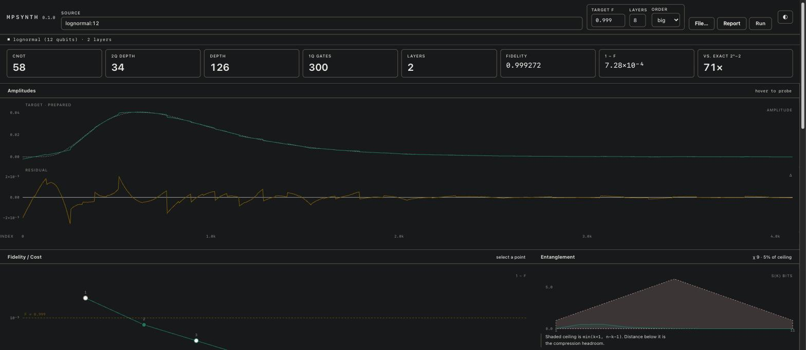
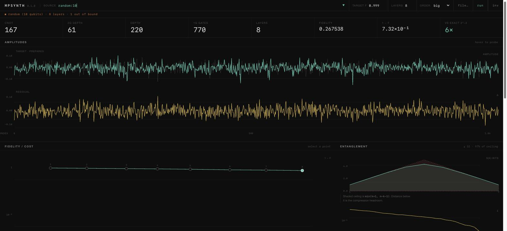

# The workbench

```console
./mpsynth ui
```



Three static files served by Python's own `http.server` — no Node, no CDN, no build.
Plots are SVG paths; gridlines, gutters and cursor rules are CSS.

A trade-off table tells you what a circuit costs. This tells you why:

| panel | reads |
| --- | --- |
| entanglement | `S(k)` per cut against the ceiling `min(k+1, n−k−1)` |
| schmidt spectrum | singular values at the centre cut, log axis — the tail that gets discarded |
| fidelity / cost | every layer count as a point; click one to synthesise and verify it |
| amplitudes | target and prepared on one axis, signed residual below, linked cursor |
| checks | measured quantity against its bound |

Three things in the stylesheet do real work rather than decoration:

- `--cursor` is one number on the strip container. Both crosshairs, and anything else
  keyed to it, position themselves from it through `calc()`. One write, N rules.
- `--n` is registered with `@property` as an `<integer>`, so it can be *transitioned*,
  and `counter()` prints it — the readout counts up with no animation loop in JS.
- `--pad-l`/`--pad-r` hold the plot gutters, and the SVG renderer reads them back out
  of the cascade, so the CSS ruler and the drawn axis cannot disagree.

## Failure looks like failure

Feed it `random:10`: entropy fills the ceiling (97%), the Schmidt spectrum flattens with
no tail to discard, fidelity/cost goes horizontal at F ≈ 0.27, and `S̄ / S_max` reads
`4.6×10⁻¹ / < 0.70` — out of bound. The circuit is still certified normalised and
unitary; it is the input that cannot be compressed.



## Take it with you

The "report" button embeds every layer on the curve — circuit, checks, every export
format — into a single self-contained HTML file. No server, no network: hover-to-probe,
click-a-point, switch export format and toggle theme all keep working when opened from
disk or emailed to someone who has never seen MPSynth.
